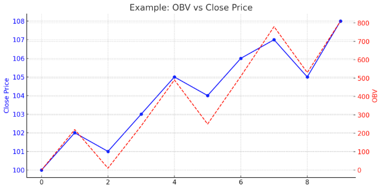

Đây, bạn nhìn vào chart này sẽ thấy:

* **Blue line (Close Price)**: giá dao động tăng giảm từng phiên.
* **Red dashed line (OBV)**: volume cộng dồn theo hướng giá.

Ví dụ: từ phiên 3 → 4, giá tăng từ 101 → 103, OBV tăng mạnh vì volume cũng cao.
Nếu giá giảm mà OBV vẫn tăng, đó là **dấu hiệu divergence**, cảnh báo có thể trend sẽ đảo chiều sớm.

OBV giúp bạn xác nhận sóng tăng/giảm trong **wave trading**, đặc biệt khi kết hợp với RSI hay candlestick patterns.

